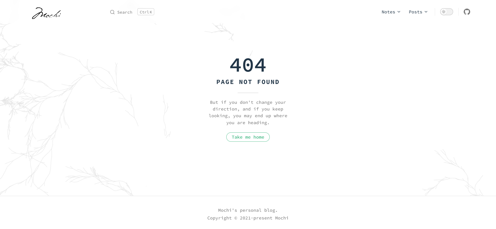

# VitePress 部署在 GitPage 成功后资源却 404

<hr />

在部署 VitePress 至 GitPage 时, 遇见了一个奇怪的现象：除了主页可以访问, 其它的文件夹资源访问都是 404。



刚开始以为是本地哪出错了, 发现 `pnpm serve` 都一切正常, 且另外一个 vitepress demo 在 gitpage 都是正常的。

心态开始崩了...:vomiting_face:

自查一番无果后直至看见了 https://segmentfault.com/q/1010000019587945 这个帖子, 才明白了问题到底出在哪。

我的文件目录是这样的：

```text {3}
mochi-blog/
└── docs/
    └── _POSTS/
        └── vitepress/
            ├── 001_vitepress.md
            └── 002_vitepress-theme-mochi.md
```

<span class="text-red-400">Github Pages 默认是基于 [Jekyll](http://jekyllcn.com/) 构建的</span>, Jekyll 是一个将纯文本转换为静态网站的工具, 它构建的网站各种目录都是特定的以下划线 `_` 开头命名的文件夹, 如 `_layouts`、`_posts`, 所以 <span class="text-red-400">Jekyll 会忽略其它以下划线开头的文件夹和文件</span>。

如果想继续使用以 `_` 命名的文件项目结构, 可以在项目根目录下添加一个 `.nojekyll` 的空白文件, 它的作用就是告诉 GitHub Pages 当前网站不是基于 Jekyll 构建的, 不要忽略下划线开头的文件和文件夹。

如果是部署在自己的服务器上, 可以把 `.nojekyll` 删掉, 一切正常。
